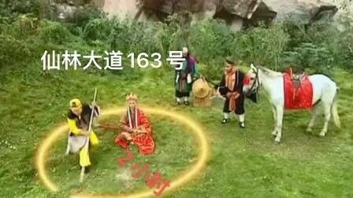

# W03

## 1.代码工作原理的理解

和W02重复代码已在W02-README中论述，此处只论述修改部分：

```java
        Geezer theGeezer = Geezer.getTheGeezer();

        SteganographyClassLoader loader = new SteganographyClassLoader(
                new URL("https://cdn.njuics.cn/example.BubbleSorter.png"));

        Class c = loader.loadClass("example.BubbleSorter");

        Sorter sorter = (Sorter) c.newInstance();

        theGeezer.setSorter(sorter);
```

根据向上委派查找类的机制，自定义了一个`SteganographyClassLoader`类加载器。在查找类的过程中，由于不存在`.java`和`.class`文件，向上委派的`BootstrapClassLoader`、`ExtClassLoader`和`AppClassLoader`均找不到需要的类。

首先创建一个老爷爷对象。然后创建一个loader加载器对象，通过在参数中创建一个URL对象来传递图片地址，在loader对象构造器中，首先调用父类的构造函数完成初始化，然后将含有图片地址的URL对象赋予成员url对象。`SteganographyClassLoader`通过继承`java.lang.ClassLoader`类的方式来实现独特的类加载器。其中`loadClass(String name) `加载名称为` name` 的类，返回的结果是` java.lang.Class` 类的实例，存储在`c`中，最后调用`c	`的方法创造一个`Sorter`对象的实例。

## 2.两个图片

选择排序：

快速排序：


## 3.

选择排序：[](https://asciinema.org/a/438072)

 

快速排序：[](https://asciinema.org/a/438073)


## 4.

202220008 同学发在群里的照片

希尔排序：[](https://asciinema.org/a/439500)


